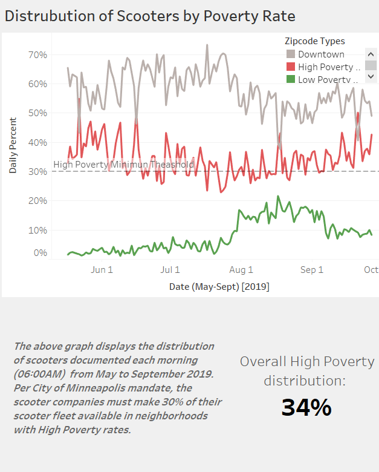

# Minneapolis Scooter Distibution Project

Project by: David Blascyk, Michael Laska, Ingris O'Connor, and Cindy Pendarvis

## Go to [Minneapolis Scooter Tableau](https://public.tableau.com/profile/david.blascyk#!/vizhome/MplsScootersProject/MinneapolisScooterProject?publish=yes) to view the final report.

ETL and Tableau Visualization project to audit the availablity of retal scooter in High-Poverty neighborhoods of Minneapolis, MN.

According to the City of Minneapolis, in order for scooter rental companies to be awarded contracts in 2019, they must ensure adequate numbers of scooters be available
in poor neighborhoods.

We chose to gather availabilty information from [Minneapolis Open Data Site](http://opendata.minneapolismn.gov/datasets/scooter-availability) and the [US Census Bureau](https://www.census.gov/developers/)
to determine whether this criteria had been met.

## Process

* Extract and merge data from three sources (Scooter availability, GIS location codes, and zipcode poverty rates) and build database.  
* Categorize scooter locations based on type of zipcode (High-Poverty neighborhood, Low-Poverty neighborhood, or Downtown).  
* Calculate distribution rates in Jupyter Notebook and then display maps and graphs in Tableau.  

**Tools**  
* Python Libraries: Pandas, Numpy, Matplotlib  
* Jupyter Notebook  
* Tableau  

**Individual contributions to the project:** ETL of data, creation of Tableau dashboards

## Additional Visuals

Snapshot of Initial data:

Snapshot of Merged and Parsed data:

Tableau Snapshots:

       

